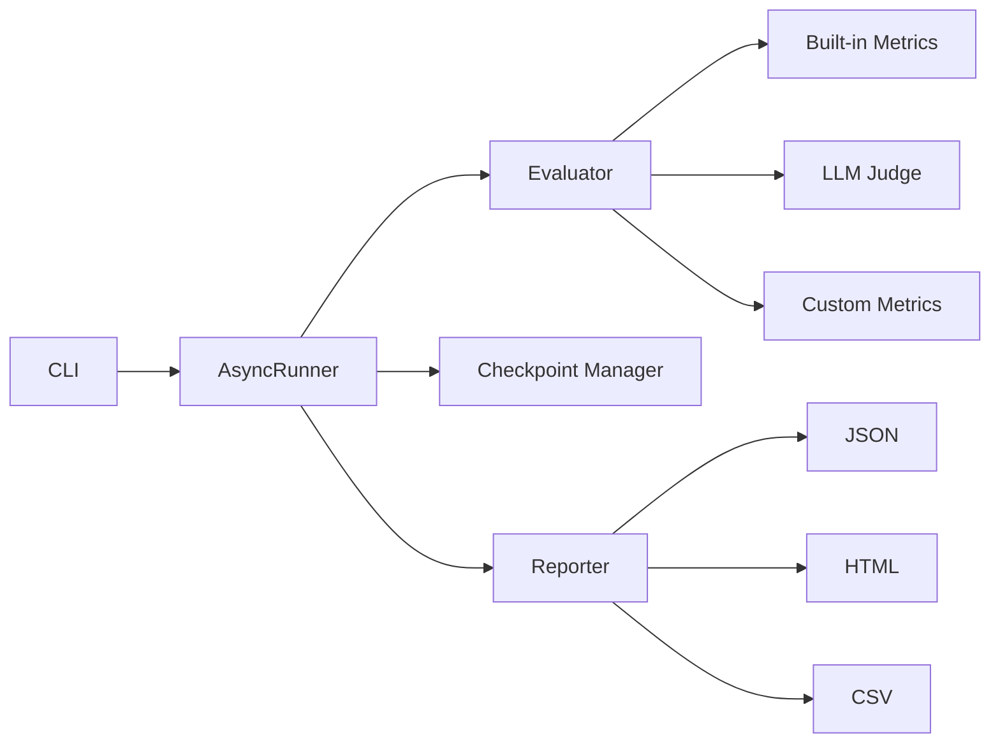

# llm-eval-framework


A configurable evaluation framework for systematically testing LLM outputs against YAML-defined test suites. Supports deterministic text metrics, embedding-based similarity, LLM-as-a-judge scoring, multi-model comparison, async execution with rate limiting, checkpoint/resume, and CI/CD integration with threshold gating.

## Features

- **YAML-driven test suites** with schema validation (Pydantic + JSON Schema)
- **13+ built-in metrics** spanning text overlap, semantic similarity, and LLM-judged quality
- **Multi-provider support** -- OpenAI, Anthropic, and AWS Bedrock out of the box
- **Async runner** with configurable concurrency, rate limiting, and progress bars
- **Checkpoint/resume** for long-running evaluations that survive interruptions
- **Model comparison** -- evaluate multiple models on the same suite side-by-side
- **CI mode** with pass/fail threshold gating and baseline regression detection
- **Cost estimation** before execution, with per-model pricing tables
- **Custom metrics** via `@register_metric` decorator or `CustomMetric` subclass
- **LLM-as-a-judge** with structured rubric scoring (relevance, coherence, groundedness, completeness)
- **Multiple output formats** -- JSON, CSV, and HTML reports

## Quick Start

```bash
# Install
pip install -e .

# Or install dependencies directly
pip install -r requirements.txt

# Create a test suite YAML (see schema below)
# Then run an evaluation
llm-eval run --suite test_suites/examples/rag_suite.yaml --model gpt-4o --provider openai

# Compare models
llm-eval compare --suite test_suites/examples/rag_suite.yaml --models gpt-4o,claude-sonnet-4-20250514

# Generate a report from existing results
llm-eval report --input reports/results.json --format html

# CI mode with threshold
llm-eval ci --suite test_suites/examples/rag_suite.yaml --threshold 0.85
```

## Metrics Reference

| Metric | Description | Range | Type |
|---|---|---|---|
| `bleu_score` | Modified n-gram precision (1-4 gram) with brevity penalty | 0 -- 1 | Deterministic |
| `rouge_l` | LCS-based F1 between reference and hypothesis tokens | 0 -- 1 | Deterministic |
| `cosine_similarity` | Cosine of angle between two embedding vectors | -1 -- 1 | Deterministic |
| `exact_match` | Normalized string equality (lowercase, stripped) | 0 or 1 | Deterministic |
| `f1_token_overlap` | Token-level precision/recall F1 (bag-of-words) | 0 -- 1 | Deterministic |
| `semantic_similarity` | Cosine similarity over text embeddings | -1 -- 1 | Embedding |
| `faithfulness` | Whether the response is grounded in the provided context | 0 -- 1 | LLM-judged |
| `answer_relevance` | How well the response addresses the question asked | 0 -- 1 | LLM-judged |
| `context_precision` | Relevance of retrieved context to the question | 0 -- 1 | LLM-judged |
| `context_recall` | Coverage of reference answer by the retrieved context | 0 -- 1 | LLM-judged |
| `factual_accuracy` | Whether claims are factually correct and verifiable | 0 -- 1 | LLM-judged |
| `hallucination_score` | Degree of unsupported or fabricated claims (lower = better) | 0 -- 1 | LLM-judged |
| `instruction_following` | Adherence to the prompt's explicit instructions | 0 -- 1 | LLM-judged |
| `consistency` | Agreement across multiple generations for the same input | 0 -- 1 | LLM-judged |

## Test Suite YAML Schema

```yaml
# name (required) -- Human-readable suite identifier
name: "RAG Retrieval-Augmented QA"

# description -- What this suite evaluates
description: "Evaluate LLM answers given retrieved context passages"

# version -- Semantic version of the suite definition
version: "1.0"

# tags -- For filtering suites
tags:
  - rag
  - retrieval
  - factual

# test_cases (required) -- At least one test case
test_cases:
  - id: rag-001                    # Unique identifier (required)
    question: "What is X?"         # The prompt sent to the LLM (required)
    expected_answer: "X is ..."    # Ground-truth reference answer (required)
    context: |                     # Optional retrieval context for RAG tests
      Supporting passage text
      retrieved from the knowledge base.
    tags:                          # Optional tags for filtering
      - factual
      - aviation
    metadata:                      # Arbitrary key-value metadata
      difficulty: easy
      source: aircraft_specs_db
```

Full schema definition: [`test_suites/schema.yaml`](test_suites/schema.yaml)

## CLI Reference

All commands support `--verbose / -v` for debug logging.

### `llm-eval run`

Run an evaluation suite against a model.

```
llm-eval run [OPTIONS]

Options:
  -s, --suite PATH           Path to test suite YAML file (required)
  -m, --model TEXT           Model name to evaluate [default: gpt-4o]
  -p, --provider CHOICE      LLM provider: openai|anthropic|bedrock [default: openai]
  -o, --output PATH          Output file path [default: reports/results.json]
  --metrics TEXT              Comma-separated metric names to evaluate
  --max-concurrent INT       Max concurrent requests [default: 10]
  --checkpoint/--no-checkpoint  Enable checkpoint/resume [default: disabled]
  --api-key TEXT             API key (or set LLM_API_KEY env var)
```

```bash
# Basic run
llm-eval run -s test_suites/examples/rag_suite.yaml -m gpt-4o

# With specific metrics and checkpoint
llm-eval run -s suite.yaml -m claude-sonnet-4-20250514 -p anthropic \
  --metrics bleu_score,rouge_l,f1_token_overlap --checkpoint

# High concurrency
llm-eval run -s suite.yaml --max-concurrent 25 -o reports/fast_run.json
```

### `llm-eval compare`

Compare multiple models on the same test suite.

```
llm-eval compare [OPTIONS]

Options:
  -s, --suite PATH           Path to test suite YAML file (required)
  -m, --models TEXT          Comma-separated model names (required)
  -p, --provider CHOICE      LLM provider: openai|anthropic|bedrock [default: openai]
  -o, --output PATH          Output HTML file [default: reports/comparison.html]
  --metrics TEXT              Comma-separated metric names
  --max-concurrent INT       Max concurrent requests [default: 10]
  --api-key TEXT             API key (or set LLM_API_KEY env var)
```

```bash
llm-eval compare -s suite.yaml -m gpt-4o,gpt-4o-mini,gpt-4-turbo -o reports/model_comparison.html
```

### `llm-eval report`

Generate a report from existing evaluation results.

```
llm-eval report [OPTIONS]

Options:
  -i, --input PATH           Input JSON results file (required)
  -f, --format CHOICE        Output format: json|csv|html [default: html]
  -o, --output PATH          Output file path (auto-generated if omitted)
```

```bash
llm-eval report -i reports/results.json -f html -o reports/dashboard.html
llm-eval report -i reports/results.json -f csv
```

### `llm-eval ci`

Run evaluation in CI mode with pass/fail exit codes.

```
llm-eval ci [OPTIONS]

Options:
  -s, --suite PATH           Path to test suite YAML (required)
  -m, --model TEXT           Model to evaluate [default: gpt-4o]
  -p, --provider CHOICE      LLM provider: openai|anthropic|bedrock [default: openai]
  -b, --baseline PATH        Baseline results JSON for regression check
  -t, --threshold FLOAT      Minimum pass rate threshold 0-1 [default: 0.8]
  -o, --output PATH          Output file path [default: reports/ci_results.json]
  --metrics TEXT              Comma-separated metric names
  --max-concurrent INT       Max concurrent requests [default: 10]
  --api-key TEXT             API key (or set LLM_API_KEY env var)
```

```bash
# Exit 0 if >= 85% pass rate, exit 1 otherwise
llm-eval ci -s suite.yaml -t 0.85

# With baseline regression detection
llm-eval ci -s suite.yaml -t 0.80 -b reports/baseline.json
```

## Example Output

### JSON Result (single test case)

```json
{
  "test_case_id": "rag-001",
  "question": "What is the maximum cruising altitude of a Boeing 737-800?",
  "expected_answer": "The Boeing 737-800 has a maximum cruising altitude of 41,000 feet.",
  "actual_answer": "The maximum cruising altitude of a Boeing 737-800 is 41,000 feet (12,497 m).",
  "scores": {
    "bleu_score": 0.6234,
    "rouge_l": 0.7891,
    "f1_token_overlap": 0.8125,
    "exact_match": 0.0
  },
  "passed": true,
  "error": null,
  "latency_seconds": 1.847,
  "model": "gpt-4o",
  "metadata": {}
}
```

### Comparison Output

```
Comparing 3 models on 'RAG Retrieval-Augmented QA'
Models: gpt-4o, gpt-4o-mini, gpt-4-turbo
Test cases: 5

--- Evaluating: gpt-4o ---
  Estimated tokens: 1,250 in / 600 out | Estimated cost: $0.0091
  gpt-4o: 5/5 passed

--- Evaluating: gpt-4o-mini ---
  Estimated tokens: 1,250 in / 600 out | Estimated cost: $0.0005
  gpt-4o-mini: 4/5 passed

--- Evaluating: gpt-4-turbo ---
  Estimated tokens: 1,250 in / 600 out | Estimated cost: $0.0305
  gpt-4-turbo: 5/5 passed

Comparison report: reports/comparison.html
JSON data: reports/comparison.json
```

## CI/CD Integration

### GitHub Actions

```yaml
name: LLM Eval

on:
  push:
    branches: [main]
  pull_request:
    branches: [main]

jobs:
  evaluate:
    runs-on: ubuntu-latest
    steps:
      - uses: actions/checkout@v4

      - name: Set up Python
        uses: actions/setup-python@v5
        with:
          python-version: "3.11"

      - name: Install dependencies
        run: |
          python -m pip install --upgrade pip
          pip install -r requirements.txt
          pip install -e .

      - name: Run evaluation suite
        env:
          LLM_API_KEY: ${{ secrets.LLM_API_KEY }}
        run: |
          llm-eval ci \
            --suite test_suites/examples/rag_suite.yaml \
            --model gpt-4o \
            --threshold 0.85 \
            --baseline reports/baseline.json \
            --output reports/ci_results.json

      - name: Upload results
        if: always()
        uses: actions/upload-artifact@v4
        with:
          name: eval-results
          path: reports/
          retention-days: 30
```

The `ci` command exits with code 1 when the pass rate falls below the threshold or a regression is detected against the baseline, failing the pipeline automatically.

## Custom Metrics

### Function-based

```python
from src.metrics.custom import register_metric

@register_metric("brevity_score")
def brevity_score(response: str, reference: str, **kwargs) -> float:
    """Score based on response length relative to reference."""
    if not reference:
        return 0.0
    ratio = len(response) / len(reference)
    # Penalize responses that are too long or too short
    return max(0.0, 1.0 - abs(1.0 - ratio))
```

### Class-based

```python
from src.metrics.custom import CustomMetric, register_metric

@register_metric("keyword_coverage")
class KeywordCoverage(CustomMetric):
    name = "keyword_coverage"

    def compute(self, response: str, reference: str, **kwargs) -> float:
        """Fraction of reference keywords present in the response."""
        ref_keywords = set(reference.lower().split())
        resp_keywords = set(response.lower().split())
        if not ref_keywords:
            return 0.0
        return len(ref_keywords & resp_keywords) / len(ref_keywords)
```

### Loading custom metrics at runtime

```python
from src.metrics.custom import load_custom_metrics

# Load from a .py file -- any @register_metric decorators execute automatically
new_metrics = load_custom_metrics("my_metrics.py")
print(f"Registered: {new_metrics}")
```

## Architecture



```
CLI (click)
 |
 ├── run / compare / report / ci
 |
 └── AsyncRunner
      ├── Semaphore + Rate Limiter (aiolimiter)
      ├── Evaluator (protocol)
      |    ├── RAG Evaluator
      |    ├── LLM Evaluator
      |    └── Comparative Evaluator
      ├── Metrics
      |    ├── builtin.py    (BLEU, ROUGE-L, cosine, exact match, F1)
      |    ├── llm_judge.py  (multi-provider rubric scoring)
      |    └── custom.py     (registry + decorator + dynamic loading)
      ├── Checkpoint Manager (resume interrupted runs)
      └── Reporters
           ├── JSONReporter
           └── HTMLReporter (Jinja2 templates)
```

## Project Structure

```
llm-eval-framework/
├── src/
│   ├── __init__.py
│   ├── cli.py                    # Click CLI with run/compare/report/ci commands
│   ├── config.py                 # EvalConfig, TestCase, SuiteConfig, YAML loader
│   ├── evaluators/
│   │   ├── __init__.py
│   │   ├── base.py               # Base evaluator interface
│   │   ├── comparative.py        # Multi-model comparison evaluator
│   │   ├── llm.py                # Generic LLM evaluator
│   │   └── rag.py                # RAG-specific evaluator
│   ├── metrics/
│   │   ├── __init__.py
│   │   ├── builtin.py            # BLEU, ROUGE-L, cosine similarity, exact match, F1
│   │   ├── custom.py             # MetricRegistry, @register_metric, dynamic loading
│   │   └── llm_judge.py          # LLM-as-a-judge with rubric scoring
│   ├── reporters/
│   │   ├── __init__.py
│   │   ├── json_reporter.py      # JSON + CSV output
│   │   ├── html_reporter.py      # HTML report generation
│   │   └── templates/
│   │       └── report.html       # Jinja2 HTML template
│   └── runners/
│       ├── __init__.py
│       ├── async_runner.py       # Async execution with concurrency + rate limiting
│       └── checkpoint.py         # Checkpoint/resume for interrupted runs
├── test_suites/
│   ├── schema.yaml               # JSON Schema for suite validation
│   └── examples/
│       ├── qa_suite.yaml         # General QA test suite
│       └── rag_suite.yaml        # RAG evaluation test suite
├── tests/
├── .github/
│   └── workflows/
│       └── ci.yml                # GitHub Actions CI pipeline
├── requirements.txt
├── setup.py
├── pyproject.toml
└── LICENSE
```

## License

MIT License. See [LICENSE](LICENSE) for details.
